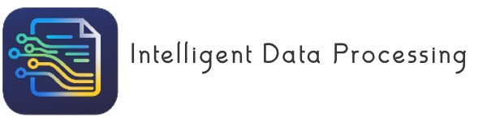
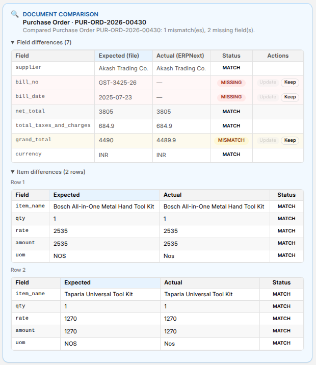
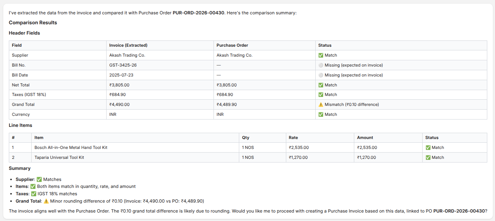
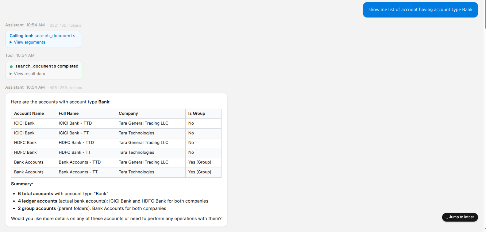
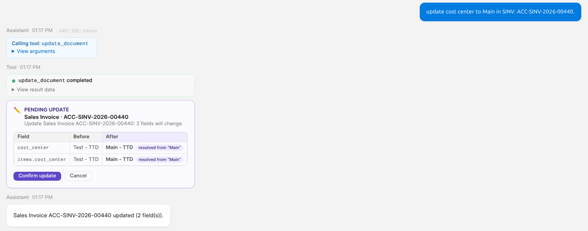
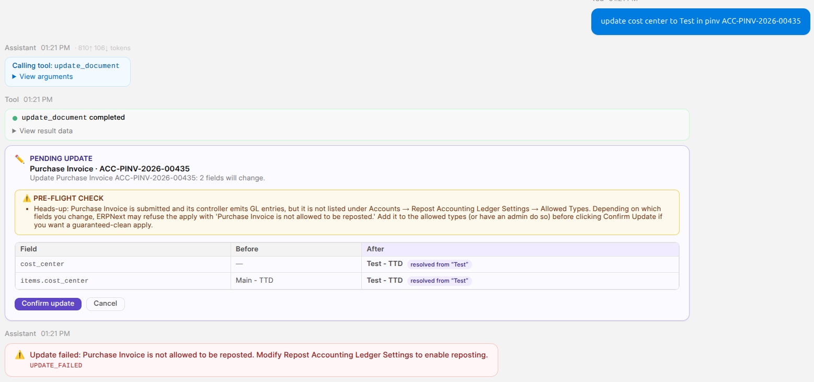
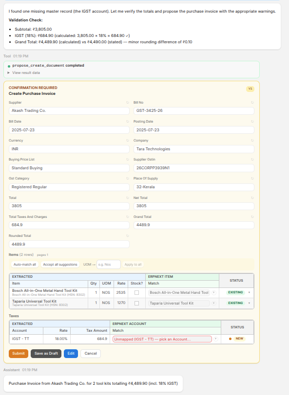

---

# Intelligent Document Processing (IDP) for Frappe / ERPNext

> A modern, conversational document‑processing app for Frappe / ERPNext.
> Upload an invoice, PO, delivery note, bank statement, or quotation — and the IDP agent extracts structured data, reconciles it against existing ERPNext records, asks for confirmation, and creates / updates the document for you. Built with Vue 3, Frappe UI, PaddleOCR, and a pluggable LLM stack (OpenAI · Anthropic · Ollama).

[](LICENSE)
[](https://www.python.org/downloads/)
[](https://frappeframework.com/)
[](https://erpnext.com/)

---

## Features

### Conversational Document Processing
- Modern single‑page chat UI built with Vue 3, Vite, Tailwind CSS, and Frappe UI
- Sidebar with conversation history, search, filter chips, archive / delete
- Upload PDFs, images, scans, Excel, CSV, or Word — the agent extracts in‑context
- Live ConfirmationCard rendered inline: editable header fields, line items, taxes
- Token‑by‑token assistant streaming via Frappe Realtime (Socket.IO / WebSocket)
- Suggested prompt chips on empty conversations, bulk actions on multi‑card turns
- Persistent **cost / tokens / duration footer** chip per conversation
- Per‑conversation **Output Language** and **OCR Language** overrides
- Optional **pre‑flight cost warning** before high‑cost turns

### Two‑Tier LLM Stack (provider‑agnostic)
- **OpenAI** (gpt‑4o, gpt‑4o‑mini, …), **Anthropic** (Claude Opus / Sonnet / Haiku 4.5), **Ollama** (local LLMs)
- Custom providers can be registered as JSON without code changes
- **Cheap tier** (Haiku / gpt‑4o‑mini) handles classification, gating, summarisation
- **Expensive tier** handles extraction and final confirmation
- Routing is configured per purpose (`classification`, `extraction`, `vision`, `summarisation`, `confirmation`)
- Anthropic *extended‑thinking* blocks supported and optionally stripped on replay

### Multi‑Format OCR
- **PaddleOCR** with 12+ languages (English, Hindi, Chinese, Arabic, French, German, Japanese, Korean, Spanish, Tamil, Telugu, Portuguese)
- **Vision fallback** via Ollama (`minicpm-v`, `llava`) when PaddleOCR fails or pypdf text is too thin
- Auto language detection per upload (`auto` mode)
- Layout analysis and table extraction (toggleable)
- Per‑page pre‑pass: pages without recognised signals are replaced with placeholders in the LLM context

### Hybrid Field Mapper
- Rule‑based **FieldMapper** with built‑in keyword sets (Indian GST, US tax, generic invoice)
- Per‑DocType **IDP Extraction Template** overrides keywords, validation rules, confidence bands, and LLM fallback thresholds
- **LLM hybrid mapping** for low‑confidence extractions
- **Mapper output cache** keyed by `(file_hash, target_doctype, mapper_version)` — re‑uploading the same bytes within TTL skips the LLM entirely
- **Few‑shot exemplars** from `IDP Extraction Correction` ledger injected into the prompt

### Schema & Business‑Rule Validation
- Pre‑validation against the target DocType's schema before the LLM extraction loop runs
- Required‑field, range, regex, and `in [...]` rules definable per template
- Auto‑resolution of missing **Supplier / Customer / Item** masters (optional)
- Document comparison against existing PO / SO / DN / Invoice records before creation
- **Approver routing** via JSON rule set (e.g. `grand_total > 100000 → Finance Manager`)

### Document Comparison & Reconciliation
- Side‑by‑side comparison of the extracted invoice with a matching Purchase Order / Sales Order
- Header‑field and line‑item diff with Match / Mismatch / Missing badges
- Bank‑statement reconciliation against Payment Entry / Journal Entry
- Comparison summary used as the agent's narrative reply





### Document Search
- Natural‑language search across any ERPNext DocType (Purchase Invoice, Sales Order, Customer, Item, …)
- Filters resolved from the chat — supplier, customer, date range, status, amount thresholds, company, currency
- Powered by the **`search_documents`** tool — supports paging, sort order, and a configurable result cap
- Returns a compact result table with the document name, primary fields, and submit / draft status
- Inline drill‑down: click any row to open the ERPNext record in a new tab
- Used by the agent as a building block for *"find the matching PO"*, *"is there an unpaid bill from ACME?"*, and *"which Sales Orders are pending delivery?"* turns



### Document Update
- Edit any field on an existing ERPNext document directly from chat
- Powered by the **`update_document`** tool with the same role gating and confirmation flow as `create_document`
- Schema pre‑validation runs before the update is dispatched — wrong fieldname, value out of range, or invalid link target is reported as a friendly error
- Inline diff in the ConfirmationCard shows **old value → new value** for every change
- Submittable documents are amended (cancel + new version) rather than mutated in place
- Failed updates surface the underlying Frappe `ValidationError` / `LinkValidationError` with the offending field highlighted





### Document Delete
- Remove draft documents (or cancel submitted ones) via the **`delete_document`** tool
- Requires explicit user confirmation by default — the dispatcher never auto‑deletes
- Role‑gated via **IDP Tool Configuration → Allowed / Denied Roles** (typically restricted to *Finance Manager* / *System Manager*)
- Cascading link checks: deletion is blocked when other ERPNext records reference the target, with the blocking docs listed in the agent reply
- Falls within the global **Undo Window** — accidental deletes can be reversed by re‑creating from the audit trail in **IDP Document Log**

### Confirmation Card
- Frappe‑UI inspired form rendered inline in the chat
- Edits flow back to the agent → re‑validated → confirmed
- Inline **green / amber / red confidence dots** on child rows
- *Auto‑match*, *Accept all suggestions*, and bulk `Apply to all` actions
- Per‑row **EXISTING / NEW** status for items and taxes
- Submit, Save as Draft, Edit, Cancel actions per card

### Reversibility & Audit
- **Undo Window** (default 5 minutes) — created drafts are deleted, submitted submittable docs are cancelled by the originating user (or System Manager)
- Full audit trail in **IDP Tool Call Log** and **IDP Document Log**
- Conversation retention with auto‑archive after N days

### Plugin System
- Bundle tools (and optionally prompt templates / skills) into a single plugin namespace
- Third‑party Frappe apps register via `hooks.py`:
  ```python
  idp_plugins = "acme_logistics.idp:AcmeLogisticsPlugin"
  ```
- Per‑plugin toggle, priority, and free‑form JSON config — all editable from the desk
- Per‑tool admin overrides: enable/disable, role gates, confirmation gate, token cap

### Multi‑Language Output
- Extracted values translated to a target output language while preserving numbers, dates, currency codes, and proper nouns
- Output language and OCR language are independent settings
- Hindi, English, and 10+ output languages supported out of the box
- Per‑skill / per‑prompt‑template language scoping

### Cost Controls
- Per‑tool **Max Output Tokens** cap
- Global **LLM Max Output Tokens** in IDP Settings
- **Inline Text Budget** to truncate OCR text shoved into tool results
- **Vision Image Max Dim** for image resize before vision calls
- **Page Pre‑Pass** to drop noise pages from the LLM context
- **Sliding‑window summariser** for long conversations
- Weekly `tokens_per_extracted_field` regression alert

### Supported Target DocTypes (out of the box)
- Purchase Invoice
- Sales Invoice
- Quotation
- Sales Order
- Purchase Order
- Delivery Note
- Purchase Receipt
- Payment Entry
- Journal Entry
- Bank Statement (reconciliation)

Custom DocTypes can be supported by adding an `IDP Extraction Template`.

---

## Demo

_Coming soon._

---

## Prerequisites

- Frappe Framework (v16+)
- ERPNext (v16+) — required for the supported DocTypes
- Python 3.14+
- Node.js 18+
- PaddleOCR system dependencies (auto‑installed via the app's Python deps)
- An API key from at least one supported LLM provider (OpenAI, Anthropic) **or** a local Ollama server

---

## Installation

```bash
# Get the app
bench get-app https://github.com/sanjay-kumar001/idp

# Install on your site
bench --site <your-site> install-app idp

# Run migrations
bench --site <your-site> migrate

# Build frontend assets
bench build --app idp

# Restart
bench restart
```

All Python dependencies (PaddleOCR, pypdf, python‑docx, openai, anthropic, …) are installed automatically with the app.

---

## Configuration

1. Navigate to **IDP Settings** at `/app/idp-settings`
2. Tick **Enabled**.
3. Pick an **LLM Provider** (OpenAI / Anthropic / Ollama), paste the API key, set the default model.
4. Add at least one row per *purpose* in **LLM Model Routes** (classification, extraction, vision, summarisation, confirmation).
5. Configure OCR:
   - Default OCR language (`en`, `hi`, `auto`, …)
   - Default Output Language (`English`, `हिन्दी`, …)
   - Confidence Threshold, Max File Size, Max Pages per PDF
6. Choose a rollout mode:
   - **Dry‑run** — leave **Enable Write Operations** off; users see ConfirmationCards but no ERPNext records are created.
   - **Live** — enable write operations and (optionally) auto‑create missing masters.
7. Turn on the cost‑aware features:
   - Page Pre‑Pass, Mapper Output Cache, Summariser, Strip Thinking Blocks.
8. Set the **Undo Window** (default 5 minutes) and **Active Retention (days)**.

For full field‑by‑field documentation, see [docs/user_manual/idp_settings.md](docs/user_manual/idp_settings.md).

---

## Usage

After setup, open the IDP chat at:

```
https://<your-site>/idp
```

Drag‑and‑drop a document onto the conversation surface, or use the file picker in the composer. Then ask a question or pick a suggested prompt.

| Prompt | What the agent does |
| --- | --- |
| *"Extract this invoice into a Purchase Invoice for Tara Technologies."* | OCR → mapping → ConfirmationCard for a Purchase Invoice. |
| *"Compare this bill against PO `PUR-ORD-2026-00430`."* | Diff header + line items vs. the PO and explain mismatches. |
| *"Create a Sales Invoice from this PDF and translate item descriptions to Hindi."* | Extract, translate text fields, render the card in Hindi. |
| *"Resolve the missing suppliers and item codes, then create the document."* | Calls `resolve_masters` / `create_master`, then `create_document`. |
| *"Reconcile this bank statement against ERPNext payments for May."* | Bank reconciliation engine returns matched / unmatched rows. |
| *"Use the ACME Purchase Invoice template."* | Forces a specific `IDP Extraction Template` for this turn. |

The agent streams a natural‑language reply, renders a ConfirmationCard with editable fields, and waits for the user to **Submit**, **Save as Draft**, **Edit**, or **Cancel**.



---

## Architecture Overview

```
idp/                                       # Python package (Frappe backend)
|
|-- api/                                   # @frappe.whitelist() endpoints
|   |-- conversation.py                    # Chat turn dispatch
|   |-- extract.py                         # OCR + mapper pipeline
|   |-- upload.py, llm.py, settings.py
|   |-- advanced.py                        # Few-shot / templates / batches
|   |-- undo.py                            # Reversibility window
|   |-- permissions.py, background.py
|
|-- idp/doctype/                           # Frappe DocTypes
|   |-- idp_settings/                      # Single — global config
|   |-- idp_conversation/, idp_message/
|   |-- idp_conversation_attachment/
|   |-- idp_document_log/, idp_tool_call_log/
|   |-- idp_batch_job/, idp_batch_job_item/
|   |-- idp_extraction_template/           # Per-DocType overrides
|   |-- idp_extraction_correction/         # Feedback ledger
|   |-- idp_prompt_library/                # Prompt gallery
|   |-- idp_prompt_template/               # Jinja system prompt
|   |-- idp_prompt_template_argument/      # Child table
|   |-- idp_skill/                         # Reusable markdown rules
|   |-- idp_tool_configuration/            # Per-tool admin overrides
|   |-- idp_tool_role/                     # Child table
|   |-- idp_plugin_configuration/          # Per-plugin toggle + JSON config
|   |-- idp_llm_model_route/               # Two-tier routing
|
|-- core/                                  # Foundation
|   |-- config.py, constants.py, errors.py
|   |-- cache.py, retention.py, metrics.py
|   |-- security.py, rate_limit.py, file_io.py
|   |-- audit.py, logger.py
|
|-- ocr/                                   # OCR layer
|   |-- engine.py                          # PaddleOCR driver
|   |-- subprocess_runner.py               # Sandboxed Paddle subprocess
|
|-- extractors/                            # Format-aware extractors
|   |-- base.py, extractor.py
|   |-- bank_statement.py                  # Specialised extractor
|   |-- ollama_vision.py                   # LLM vision fallback
|
|-- mappers/                               # Field mapping + reconciliation
|   |-- mapper.py                          # Rule-based FieldMapper
|   |-- hybrid_mapper.py                   # Rule + LLM hybrid
|   |-- document_creator.py                # Builds final Frappe doc
|   |-- prerequisites.py                   # Missing-master resolver
|   |-- fuzzy_match.py, item_matcher.py
|   |-- tax_extractor.py, tax_matcher.py
|   |-- keywords_ml.py                     # Keyword suggestions from feedback
|
|-- validators/
|   |-- schema_validator.py                # ERPNext schema pre-flight
|   |-- business_rules.py                  # Required / range / regex / in
|
|-- comparison/
|   |-- engine.py                          # Header + line-item diff
|
|-- reconciliation/
|   |-- bank_reconciliation.py
|
|-- llm/                                   # LLM stack
|   |-- agent.py                           # Tool-using agent loop
|   |-- client.py, model_registry.py
|   |-- prompts.py, prompt_templates.py    # Jinja prompts
|   |-- skills.py                          # Markdown skill assembler
|   |-- page_prepass.py                    # Per-page signal gating
|   |-- summariser.py                      # Sliding-window digest
|   |-- token_counter.py, cancellation.py
|   |-- translation.py, message_renderer.py
|   |-- providers/
|       |-- registry.py
|       |-- openai_provider.py
|       |-- anthropic_provider.py
|       |-- ollama_provider.py
|
|-- tools/                                 # Agent-callable tools
|   |-- registry.py, registry_cache.py
|   |-- base.py, access.py, audit.py
|   |-- extract_document.py                # Mapper entry point
|   |-- create_document.py                 # ERPNext doc creator
|   |-- propose_create_document.py
|   |-- update_document.py, delete_document.py
|   |-- validate_document.py
|   |-- compare_document.py                # Diff vs. existing record
|   |-- find_matching_record.py
|   |-- resolve_masters.py                 # Auto-fill Supplier / Customer / Item
|   |-- create_master.py, list_missing_masters.py
|   |-- search_documents.py
|   |-- read_attachment_more.py
|   |-- ask_user.py                        # Clarification tool
|
|-- plugins/                               # Plugin loader
|   |-- base.py, loader.py
|   |-- core_plugin.py                     # Ships built-in tools
|
|-- advanced/                              # Cross-cutting helpers
|   |-- feedback.py                        # IDP Extraction Correction loop
|   |-- fine_tuning.py                     # Dataset export
|   |-- prompt_library.py                  # Built-in prompt gallery
|   |-- templates.py, tables.py, workflow.py
|   |-- batch.py                           # Bulk extraction jobs
|
|-- fixtures/                              # Seed data (prompts, skills, plugin rows)
|-- patches/                               # Migration patches
|-- public/                                # Compiled frontend assets
|-- workspace_sidebar/                     # Desk workspace
|-- www/                                   # /idp SPA mount
|-- tests/                                 # Test suite
|-- hooks.py                               # Frappe app hooks


frontend/                                  # Vue 3 SPA (source)
|
|-- src/
|   |-- pages/                             # Chat shell, settings, batch
|   |-- components/
|   |   |-- ChatView, Sidebar, Composer
|   |   |-- ConfirmationCard               # Inline editable card
|   |   |-- ComparisonResult, FieldDots
|   |-- utils/api.js                       # IDP API client (CSRF + streaming)
|
|-- vite.config.js                         # Build config
|-- tailwind.config.js                     # Tailwind CSS configuration
```

---

## Plugin System

External Frappe apps can register custom tools (and bundle prompt templates / skills) with the IDP agent without modifying this app.

### 1. Define a plugin in your app

```python
# my_app/idp_integration.py

from idp.plugins.base import IDPPlugin
from idp.tools.base import ToolSpec
from my_app.idp_integration.tools import get_delivery_status

class AcmeLogisticsPlugin(IDPPlugin):
    name = "acme_logistics"
    display_name = "Acme Logistics — Delivery Tools"
    version = "2.3.1"
    description = "Adds delivery_note extraction tuned for Acme."

    def get_tools(self):
        return [
            ToolSpec(
                name="get_delivery_status",
                description="Return the live delivery status for a tracking id.",
                parameters={"tracking_id": {"type": "string"}},
                mutating=False,
                handler=get_delivery_status,
            ),
        ]
```

### 2. Register the plugin in `hooks.py`

```python
# my_app/hooks.py

idp_plugins = "my_app.idp_integration:AcmeLogisticsPlugin"

# …or for tool-only contributions:
idp_tools = "my_app.idp_integration.get_tools"
```

### 3. Toggle and configure from the desk

After `bench migrate`, a row appears at `/app/idp-plugin-configuration/acme_logistics`. Admins can:
- Enable / disable the plugin.
- Adjust `priority` (lower loads first).
- Paste plugin‑specific JSON into **Config (JSON)** — read by the plugin at runtime.
- Set per‑tool role gates and confirmation flags at `/app/idp-tool-configuration`.

Cache invalidation is automatic; no `bench restart` required for plugin or tool toggles.

---

## Development

### Frontend

```bash
cd apps/idp/frontend

# Install dependencies
yarn install

# Start dev server (proxies API to Frappe)
yarn dev

# Production build (outputs to idp/public/frontend)
yarn build

# Run Playwright tests
yarn test
```

### Backend

```bash
# Start Frappe development server
bench start

# Run backend tests
bench --site <your-site> run-tests --app idp

# Linting
ruff check .
ruff format .

# Or via pre-commit
pre-commit run --all-files
```

### Code Conventions

- **Python**: Tabs for indentation, 110‑character line length, double quotes, type hints
- **JavaScript / Vue**: Vue 3 Composition API (`<script setup>`), Tailwind CSS
- **API pattern**: `@frappe.whitelist()` decorators, Frappe ORM (`frappe.qb` / `frappe.get_all`) for database access — no raw SQL with string interpolation
- **Error handling**: `try / except` with `frappe.log_error()` and the `IDPError` family in `idp.core.errors`
- **Logging**: `from idp.core.logger import get_logger`
- **Caching**: `from idp.core.cache import cache_get / cache_set / cache_delete`

### Dependencies

**Python (runtime)**: frappe, paddleocr, paddlepaddle, pypdf, python‑docx, openpyxl, openai, anthropic, requests, jinja2

**Frontend**: vue 3, vue‑router, marked, highlight.js, lucide‑vue‑next, tailwindcss, frappe‑ui, socket.io‑client

---

## Documentation

### Project documentation

| Document | Description |
| --- | --- |
| [docs/PROJECT_OVERVIEW.md](docs/PROJECT_OVERVIEW.md) | High‑level architecture and design decisions |
| [docs/PROJECT_STRUCTURE.md](docs/PROJECT_STRUCTURE.md) | Detailed file and directory structure |
| [docs/prompt-guide.md](docs/prompt-guide.md) | How prompts, skills, and templates compose |

### DocType user manuals

Field‑by‑field guides for the configurable DocTypes. Each manual covers
when to use the DocType, every field, JSON / Jinja formats, sample
records, end‑to‑end workflows, permissions, troubleshooting, and
related DocTypes.

| Manual | Description |
| --- | --- |
| [docs/user_manual/idp_settings.md](docs/user_manual/idp_settings.md) | Single DocType that controls the whole module — LLM provider, two‑tier routing, OCR engine, hybrid mapper, conversation UX, retention, undo window |
| [docs/user_manual/idp_extraction_correction.md](docs/user_manual/idp_extraction_correction.md) | Learning ledger — every user correction of an extracted value. Feeds the few‑shot prompt builder and rule‑mapper keyword tuning |
| [docs/user_manual/idp_extraction_template.md](docs/user_manual/idp_extraction_template.md) | Per‑DocType overrides — custom field mappings, validation rules, page pre‑pass patterns, confidence bands, LLM fallback threshold |
| [docs/user_manual/idp_prompt_library.md](docs/user_manual/idp_prompt_library.md) | Catalogue of LLM system‑prompt snippets tuned per industry / DocType. Built‑ins seed on install; admins can fork, edit, disable |
| [docs/user_manual/idp_prompt_template.md](docs/user_manual/idp_prompt_template.md) | Jinja‑templated active system prompt selected per `(target_doctype, language)`. Includes the **Arguments** child table for typed variables |
| [docs/user_manual/idp_skill.md](docs/user_manual/idp_skill.md) | Short reusable markdown rule blocks (e.g. *GST handling*, *date formats*) appended to the system prompt for matching conversations |
| [docs/user_manual/idp_tool_configuration.md](docs/user_manual/idp_tool_configuration.md) | Admin override layer per tool — enable/disable, force confirmation, allow / deny roles, cap output tokens, add notes |
| [docs/user_manual/idp_plugin_configuration.md](docs/user_manual/idp_plugin_configuration.md) | Runtime registry for IDP plugins — enable/disable, priority, version, and free‑form JSON config consumed by the plugin |

---

## 🤝 Contributing

Contributions welcome! Please:
1. Fork the repository
2. Create a feature branch
3. Commit changes
4. Open a pull request

## 📄 License

MIT License — See LICENSE file

## 📞 Support

- **Documentation**: See the `docs/` folder
- **Issues**: GitHub Issues
- **Email**: sanjay.kumar001@gmail.com

---

**Built with Claude.AI by Sanjay Kumar for the Frappe / ERPNext Community**
